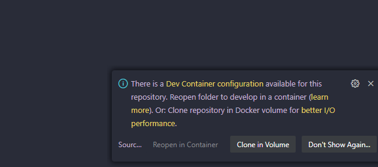

# Getting Started with React in vscode dev containers

## Table of Contents
- [Overview](#Overview)
- [Starting off project in local environment](#starting-off-in-local-environment)
- [Starting off in vscode dev container](#starting-off-in-vscode-dev-container)
    - [Pre-requisites for dev containers](#prerequisites)
    - [Run app inside dev container](#run-app-inside-dev-container)
- [Other commands](#other-commands)

## Overview

This project was bootstrapped with [Create React App](https://github.com/facebook/create-react-app).

## Starting off in local environment

In the project directory, you can run:

### `npm install`

Installs all dependencies needed to run the app

### `npm start`

Runs the app in the development mode.\
Open [http://localhost:3000](http://localhost:3000) to view it in your browser.

The page will reload when you make changes.\
You may also see any lint errors in the console.

## Starting off in vscode dev container

You can get started with react using vscode dev container. Make sure you have these pre-requisities installed

### Prerequisites

- Make sure you have docker running. For windows you can install [Docker Desktop](https://docs.docker.com/desktop/install/windows-install/#:~:text=Docker%20only%20supports%20Docker%20Desktop%20on%20Windows%20for,as%20Windows%20Server%202019%20or%20Windows%20Server%202022.) manually.
Alternatively you can also run below powershell script to install wsl2 and docker desktop

```powershell
## Install wsl
wsl --install

# Set WSL 2 as default version
wsl --set-default-version 2

# Install a specific Linux distribution (e.g., Ubuntu)
wsl --install -d Ubuntu

## Download docker desktop
Invoke-WebRequest -Uri https://desktop.docker.com/win/stable/Docker%20Desktop%20Installer.exe -OutFile DockerDesktopInstaller.exe

# Install Docker Desktop
Start-Process -Wait -FilePath .\DockerDesktopInstaller.exe -ArgumentList 'install', '--accept-license', '--always-run-service'

# Clean up the installer file
Remove-Item .\DockerDesktopInstaller.exe

# System restarts, after that do these

# Verify Docker installation
docker --version

# Run a test Docker container
docker run hello-world
```

- Make sure you have [vscode](https://code.visualstudio.com/download) installed and extension [Dev Containers extension](vscode:extension/ms-vscode-remote.remote-containers)
Alternatively you can also run below powershell script to setup these

```powershell
## Install chocolatey and apps

try {
    choco config get cacheLocation
}
catch {
    Write-Output "Chocolatey not detected, trying to install now"
    Invoke-Expression ((New-Object System.Net.WebClient).DownloadString('https://chocolatey.org/install.ps1'))
}

$chocolateyAppList = 'git.install|2.41.0,vscode|1.91.1,materialicon-vscode|4.28.0'

$appsToInstall = $chocolateyAppList -split "," | foreach { "$($_.Trim())" }

foreach ($app in $appsToInstall) {

    $name = $app.Split("|")[0]
    $version = $app.Split("|")[1]
    $params = $app.Split("|")[2]
    
    Write-Host "Installing: $name | $version with extra params: [$params]"

    if ($null -eq $params) {
        Write-Host "choco install $name --version $version  /y -Force | Write-Output"
        & choco install $name --version $version  /y -Force | Write-Output
    }
    else {
        Write-Host "Installing: $name | $version"
        & choco install $name --version $version  --params $params /y -Force | Write-Output
    }
}

Start-Process "C:\Program Files\Microsoft VS Code\bin\code.cmd" -ArgumentList "--install-extension","ms-vscode-remote.remote-containers","--force" -wait
```

### Run app inside dev container

- Git clone this repo
- Go to the repo root and open project in vscode.
- Once you have Dev Containers extension installed and docker running, vscode will prompt you to open the folder in container. You have two options:
    - Reopen in dev container: Files stay where they are and you work on them directly from the linked docker volume.
    - Clone in volume: Preferred for windows users with wsl2. It clones a copy of the project into a docker container and volume. This options is faster on windows.



## Other commands

### `npm test`

Launches the test runner in the interactive watch mode.\
See the section about [running tests](https://facebook.github.io/create-react-app/docs/running-tests) for more information.

### `npm run build`

Builds the app for production to the `build` folder.\
It correctly bundles React in production mode and optimizes the build for the best performance.

The build is minified and the filenames include the hashes.\
Your app is ready to be deployed!

See the section about [deployment](https://facebook.github.io/create-react-app/docs/deployment) for more information.


